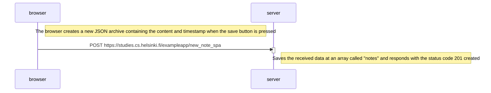

```mermaid
sequenceDiagram
    participant browser
    participant server

    Note right of browser: The browser creates a new JSON archive containing the content and timestamp when the save button is pressed

    browser->>server: POST https://studies.cs.helsinki.fi/exampleapp/new_note_spa
    activate server
    deactivate server

    Note right of server: Saves the received data at an array called "notes" and responds with the status code 201 created
```
